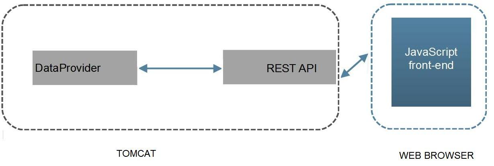

local
# fx_trade
##FX Market Trade Processor

## INSTALLATION REQUIREMENTS
Tomcat 8 or equivalent Servlet container 3.0 ready .
Java JVM 7 .

## LIMITATIONS
Only two currencies are allowed : EUR, GBP.
Only these origin countries are allowed: FRA, IRL, UK, USA .

## ARCHITECTURE

## ENDPOINTS   
- For testing that the service is up and running: http://<host>:8080/restapi/rest/trade/gettest?tradeid=1
- For posting data: http://<host>:8080/restapi/rest/trade/add
 Use set Content-Type to application/json and a payload like this:
{"userId": "134256", "currencyFrom": "EUR", "currencyTo": "GBP", "amountSell": 
"900", "amountBuy": "450", "rate": "0.7471", "timePlaced" : "24-JAN-15 10:27:4", "originatingCountry" : "FR"}
- Frontend for rendering of data through websockets http://<host>:/restapi/index.html

## MESSAGE CONSUMPTION
- Consumed messages are received to a REST framework and written in RAM data structure.
- Rate limiting is implemented with a Servlet Filter that limits the rate of incoming requests at the Application level.
It may return 429 Too Many Requests response.

## MESSAGE PROCESSOR
-  Currency volume of messages from one currency pair market (EUR/GBP) is calculated and saved.
- Messages are sent through a realtime framework which pushes transformed data to a websocket  
frontend.

## MESSAGE FRONTEND
Two html and javascript pages renders graphing currency volume of messages from the (EUR/GBP) currency 
pair market.
- index.html uses websockets
- fixed.html uses REST

## SECURITY
- The API is rate limited.
- Input data is validated.
- Logged input validation failures.
- Strong typing: incoming data is strogly typed as quickly as possible. 