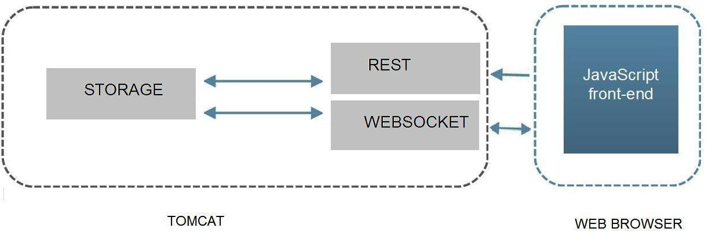

# fx_trade
FX Market Trade Processor

INSTALLATION REQUIREMENTS
Tomcat 8 or equivalent Servlet container.
Java JVM 7 .

LIMITATIONS
Only two currencies are allowed : EUR, GBP.

ARCHITECTURE

--------------   ----------    -------------------
|DATAPROVIDER|<-->|REST_API| <-->|RICKSHAW FRONTEND| 
--------------   ----------    -------------------
_____________TOMCAT________    ______BROWSER_____

ENDPOINTS   
- For testing http://<host>:8080/restapi/rest/trade/gettest?tradeid=1
- For putting data http://<host>:8080/restapi/rest/trade/add
 Use set Content-Type to application/json and a payload like this:
{"userId": "134256", "currencyFrom": "EUR", "currencyTo": "GBP", "amountSell": 
"900", "amountBuy": "450", "rate": "0.7471", "timePlaced" : "24-JAN-15 10:27:4", "originatingCountry" : "FR"}
- Frontend for rendering of data http://<host>:/restapi/fixed.html

MESSAGE CONSUMPTION
- Consumed messages are received to a REST framework and written in RAM data structure.
- Rate is implemented with a Servlet Filter that limits the rate of incoming requests at the Application level.
It may return 429 Too Many Requests response.

MESSAGE PROCESSOR
-  Currency volume of messages from one currency pair market (EUR/GBP) is calculated and saved.
- Messages are sent through a realtime framework which pushes transformed data to a Socket.io 
frontend.

MESSAGE FRONTEND
An html and javascript page renders graphing currency volume of messages from the (EUR/GBP) currency 
pair market.
